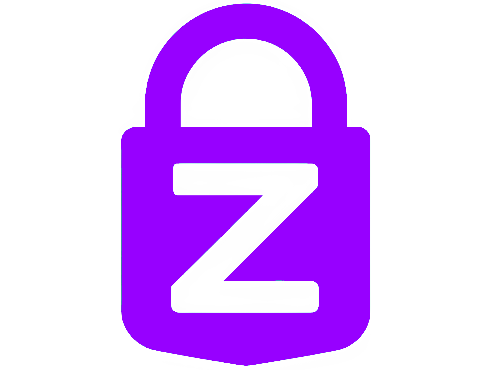
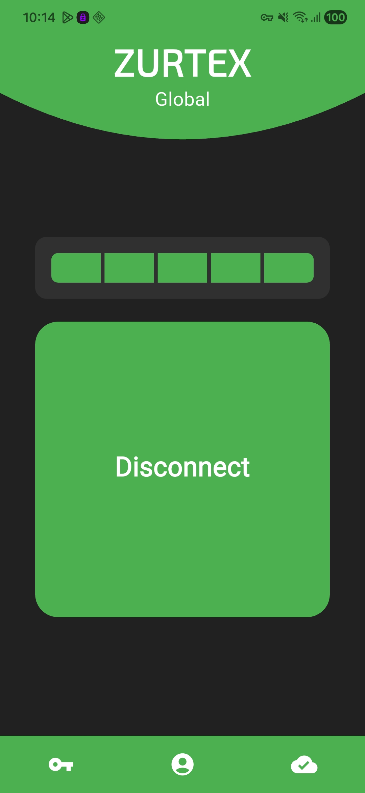
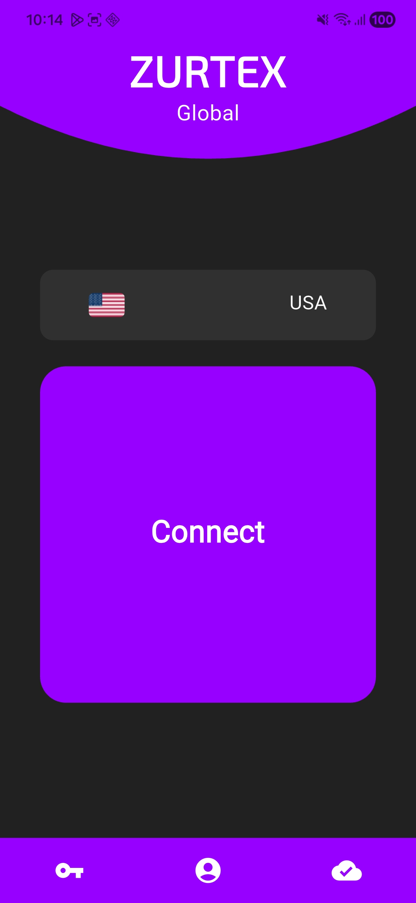
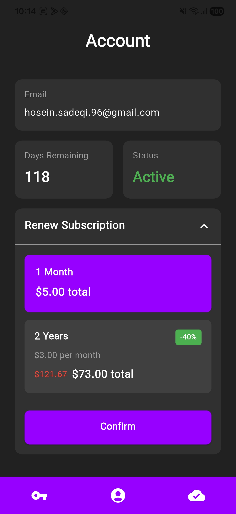

# Zurtex Global

<p align="center">
  
</p>

**Zurtex Global** is a free, open-source VPN application designed to provide secure and private internet access. Built with Flutter and powered by the V2Ray protocol, it helps users bypass internet censorship and protect their online privacy.

[](https://www.gnu.org/licenses/gpl-3.0)
[](https://flutter.dev)
[](https://www.android.com/)

## Features

- 🔒 **Secure & Private**: End-to-end encrypted connections using V2Ray protocol (VLESS, VMess)
- 🌍 **Multiple Servers**: Connect to VPN servers worldwide
- ⚡ **Fast & Reliable**: Automatic server selection based on ping for optimal performance
- 📊 **Real-time Monitoring**: Track connection status, speed, and data usage
- 🎯 **Simple Interface**: Clean, Material Design 3 UI for easy navigation
- 🔔 **Clean Notifications**: Localized notifications showing country flags and English names
- 🔐 **No Tracking**: Zero logging policy - your privacy is our priority
- 💎 **Subscription-based**: Pay securely with Litecoin cryptocurrency

## Screenshots

<p align="center">
  
  
  
</p>

## Download

- **F-Droid**: Coming soon
- **Google Play**: Coming soon
- **GitHub Releases**: [Download APK](https://github.com/AH96HSQ/Zurtex-Global/releases)

## Building from Source

### Prerequisites

- Flutter SDK 3.8.1 or higher
- Android SDK (API level 21+)
- Git

### Steps

1. Clone the repository:
```bash
git clone https://github.com/AH96HSQ/Zurtex-Global.git
cd Zurtex-Global
```

2. Install dependencies:
```bash
flutter pub get
```

3. Create `.env` file in the project root with backend configuration:
```env
BACKEND_BASE_URL=your_backend_url
BACKEND_BACKUP_URL=your_backup_url
```

4. Build the APK:
```bash
flutter build apk --release
```

Or build App Bundle for Google Play:
```bash
flutter build appbundle --release
```

The built APK will be at `build/app/outputs/flutter-apk/app-release.apk`

## Backend Setup

This app requires a backend server for VPN configuration management. The backend source is included in the `Backend/` directory.

**Note**: Sensitive credentials are stored in `Backend/.env` which is not included in the repository. See `Backend/.env.example` for the required environment variables.

## Dependencies

Key packages used:
- `flutter_v2ray` - V2Ray protocol implementation
- `http` & `dio` - Network requests
- `shared_preferences` - Local data storage
- `package_info_plus` - App version info
- `flutter_dotenv` - Environment configuration

See [pubspec.yaml](pubspec.yaml) for complete list.

## Contributing

Contributions are welcome! Please read [CONTRIBUTING.md](CONTRIBUTING.md) for guidelines.

1. Fork the repository
2. Create your feature branch (`git checkout -b feature/amazing-feature`)
3. Commit your changes (`git commit -m 'Add some amazing feature'`)
4. Push to the branch (`git push origin feature/amazing-feature`)
5. Open a Pull Request

## License

This project is licensed under the GNU General Public License v3.0 - see the [LICENSE](LICENSE) file for details.

## Privacy Policy

We respect your privacy. Read our full [Privacy Policy](PRIVACY.md) to understand how we handle data.

**TL;DR**: We don't track, log, or sell your data. Ever.

## Support

- **Website**: [zurtex.com](https://zurtex.com)
- **Email**: support@zurtex.com
- **Issues**: [GitHub Issues](https://github.com/AH96HSQ/Zurtex-Global/issues)

## Disclaimer

This software is provided "as is" for educational and privacy purposes. Users are responsible for complying with their local laws and regulations regarding VPN usage.

---

Made with ❤️ for internet freedom
